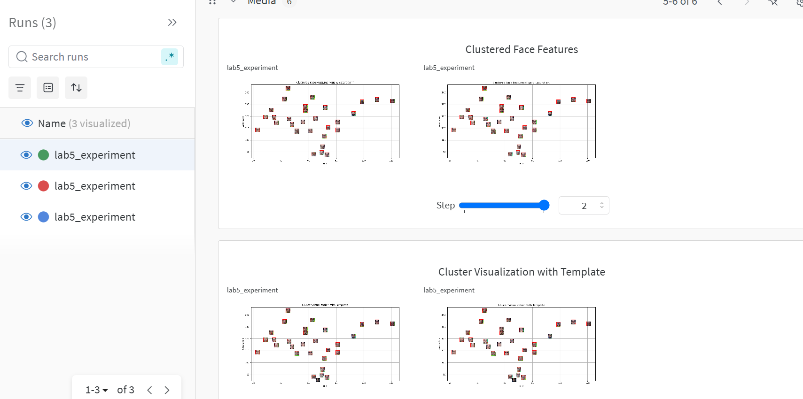
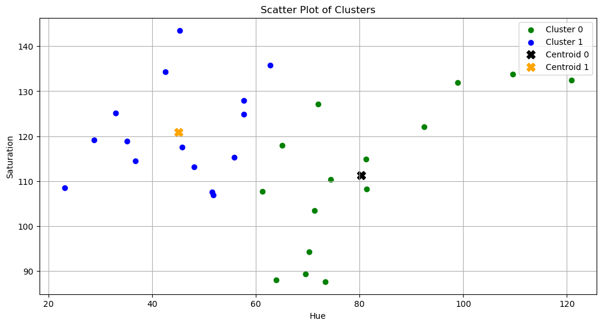
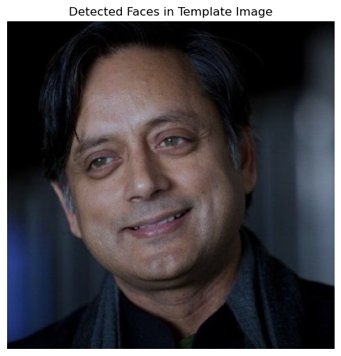

# MLPR Lab 5

## Wandb Dashboard screenshots

## Plots and output of jupyter notebook

## Report:

#### 1. What are the common distance metrics used in distance-based classification algorithms?

Some common metrics are:

- Eucledian Distance, which is the straight line distance between two points in an eucledian space.
- Mahattan distance (city block distance), which is distance between two points measured along axis at right angles.
- Chebyshev distance, where the distance between two vectors is the greatest of their differences along any coordinate dimension.
- Cosine distance, which measures angle between two vectors.

#### 2. What are some real-world applications of distance-based classification algorithms?

Distance based algorithms like KNN are used in many applications like: recommender system for suggesting things with similar characteristics, text classification to detect similar messages like spam, medical diagnosis to classify patient data.

#### 3. Explain various distance metrics.

- Eucledian distance: It is the most common general purpose distance in low dimensions spaces. It is very sensitive to scale of data. It's formula:
  $$
  d(x, y) = \sqrt{\sum_{i=1}^{n} (x_i - y_i)^2}
  $$
- Mahalanobis distance: It accounts for correlation between features and then calculates the distance. It is good for dataset with correlated features. It's formula:
  $$ d(x, y) = \sqrt{(x - y)^T S^{-1} (x - y)} $$
- Cosine distance: It measures orientation rather than magnitude. Used in high dimensional space where direction of vector matters more than the magnitude. It's formula:
  $$ d(x, y) = 1 - \frac{x \cdot y}{\|x\| \|y\|} $$

#### 4. What is the role of cross validation in model performance?

Cross validation is used to analyze the generalizability of a model. In some models, it is very helpful in tuning the hyperparameters like 'k' in KNN. It also prevents overfitting. When we partition data into several folds and train the model on the remaining subset and every data point gets to be in the test set once, so it gives reliable estimate of how good the model is performing.

#### 5. Explain variance and bias in terms of KNN?

Bias is the inability of model to perform because of some differnce/error occuring between model's predicted value and actual value. For low bias, the model will match the training dataset and for high bias, model will not match training dataset. For KNN, if we have large k, there is a smooth decision boundary and it leads to higher bias. Meaning the model is over simplyfying.

Variance is the amount by which performance of predictive model changes when trained on different subsets of data. It measures how sensitive it is to another susbet of training dataset. For KNN, small k means that model is influenced a lot by the noise and individual data points, which leads to high variance where model is good on training data but bad on unseen data.
